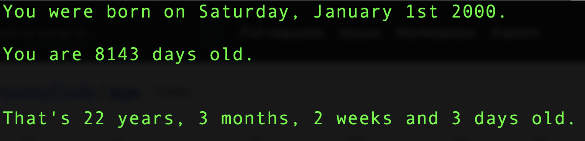

# AGE

## What is Age?

Age is a simple Python 3 program. The program takes in a birthdate and returns how old the user is in days, as well as how old the user is in years, months, weeks, and days.

## Setup: Follow these instructions exactly

1. Open your terminal
1. Clone this repository
1. `cd` into the directory it creates
1. type `python3 age.py` into the terminal and press `enter`
1. Follow the instructions by typing in your birthdate and pressing `enter`
1. Enjoy your awesome results!

